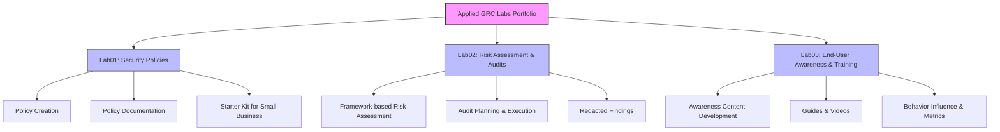

# Applied GRC Labs – Portfolio

Welcome to my **Applied GRC Labs**, showcasing practical, real-world exercises aligned with **ISO 27001**, CISM domains, and general governance, risk, and compliance (GRC) principles. These labs demonstrate hands-on skills suitable for interviews, client projects, and professional portfolio building.

## 🚀 Labs Overview

| Lab | Focus | Description |
|-----|-------|-------------|
| [Lab01 – Writing Information Security Policies](Lab01/README.md) | Policy Development | Creation of actionable, real-world security policies suitable for small businesses or enterprise environments. Includes Acceptable Use, Access Control, Data Classification, and Incident Reporting policies. |
| [Lab02 – Risk Assessment & Audit Exercises](Lab02/README.md) | Risk Management | Performing practical audits and risk assessments using frameworks such as NIST CSF, CIS Controls, and ISO 27001. Includes examples of risk evaluation, mitigation recommendations, and redacted audit findings. |
| [Lab03 – End-User Awareness & Training Materials](Lab03/README.md) | Awareness & Training | Development of cybersecurity awareness programs, including guides, videos, and interactive materials designed to influence positive security behavior among employees. |

## 🎯 Purpose

- Demonstrate applied knowledge of GRC and security best practices.
- Provide tangible examples of policies, assessments, and training materials.
- Serve as interview-ready portfolio artifacts for GRC, security governance, and risk management roles.

## 📂 Navigation

Each lab contains its own **README** with links to its specific exercises and examples:

- [Lab01 – Writing Information Security Policies](Lab01/README.md)  
- [Lab02 – Risk Assessment & Audit Exercises](Lab02/README.md)  
- [Lab03 – End-User Awareness & Training Materials](Lab03/README.md)

---

